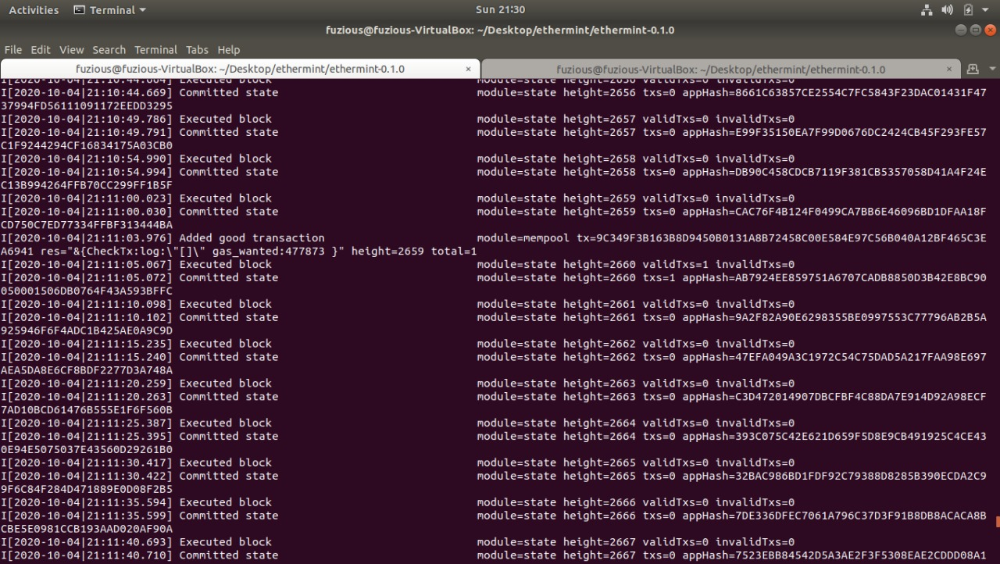

<a href=""><h1 align="center">Off Submit Ethermint</h1></a>
<h4 align="center">Making online exams happen offline</h4>

## Links

- [💻 Web App](https://offsubmit-ethmint.netlify.app/)
- [📱 Mobile App](./app_1.0.2.apk)
- [📹 Presentation Video](https://drive.google.com/file/d/18ilqagF6-qLHF-YP5sV5GT4aETjwYpJ9/view?usp=sharing)

## The problem:

- Due to COVID, many institutes decided to conduct remote online open-book exams.
- Internet speed in many parts of India is insufficient for downloading the question papers and submitting answer sheets in a quick time.
- Students of Jammu & Kashmir also face a lot of problems due to no 4G services.
- This caused a lot of students inconvenience and even to opt-out of the remote exams.

## How it solves:

The teacher will get a wallet for creating an Ethermint smart contract for his course and upload his question paper which will then be AES-128 encrypted and stored on IPFS.

10 to 15 days before the exam, students will have to download the AES encrypted question papers of all exams collectively. Since now the student has sufficient time so there are no worries of slow internet speed.

Just before the beginning of each exam, the teacher will SMS the password to unlock that question paper and the app will decrypt the question paper so that students can now see it and start with the exam.

After writing the answer sheet, the student will create a pdf and the app will then create an SHA-256 hash of it and this hash will be sent as SMS from the student’s phone to Twilio no. and if the student has sent the SMS before the deadline of the exam, say 1 hour later, then this hash will be stored on the Ethermint chain corresponding to his id.

Now the previous process will be repeated for the remaining of the exams.

Once all the exams are over then the student can upload his answer sheets pdf taking an ample amount of time so that there is no inconvenience for slow internet speed users.

Now the app will check whether the student has uploaded the same answer sheets by matching the uploaded file’s hash and previously SMS hash stored on the Ethermint blockchain.

This will check that student has not tampered with the file after the deadline of the exam.

Now the professor can download the answer sheets and do the evaluation.

## Difficulties faced

Since we didn't have sufficient AWS/GCP credits for ethermint to be deployed online so we had to establish ssh connection from localhost by exposing IP to webapp deployed to connect webapp to ethermint

## Setting up locally

- Setting up ethermint [Download ethermint](https://github.com/ChainSafe/ethermint/archive/v0.1.0.zip) v0.1.0 release

- Extract the zip and set up ethermint by `make install` or [for reference](https://docs.ethermint.zone/quickstart/installation.html) Inside the terminal in the extracted director run `./init.sh` to start up ethermint Set up ethermint cli for rpc server.

- Connecting the local rpc with remotely deployed offsubmit app by Exposing IP’s 8545 port globally by running the ngrok script given in the zip file by running `./ngrok http 8545`

- Configuring the remote. Now deploying the solidity CourseCreator.sol on the ethermint For this just perform this curl request which will deploy the contract.

> `curl -XPOST -H "Content-type: application/json" -d '{ "url": "http://51b9bfb1446c.ngrok.io" }' 'https://offsubmit.herokuapp.com/newStudentWallet'`

## Setting up metamask

Set up custom RPC :

> In network name write: offsubmit-ethmint In RPC Url
> Write the url obtained in step 2 then save

## Requesting Test Ether of Ethermint

`curl -XGET 'https://offsubmit.herokuapp.com/reqEther/<your public key here>'`

## Deployed Contract

## Tech Stack

	
Blockchain

		<ul>
			<li>Ethermint</li>
		  <li>Solidity</li>
		</ul>

	
Backend

		<ul>
			<li>Node.js</li>
			<li>Twilio SMS API</li>
		  <li>Web3js</li>
		</ul>

	
Frontend

		<ul>
			<li>React</li>
			<li>Web3.js</li>
		</ul>

	
Mobile App

		<ul>
			<li>Flutter</li>
			<li>Crypto</li>
		</ul>

## Team

- [ 👨🏻‍💻 Ashutosh Singh](https://github.com/thecodepapaya)
- [ 👨🏻‍🎓 Arpit Srivastava](https://github.com/fuzious)
- [ 🌊 Aman Raj](https://github.com/AmanRaj1608)

 Made with ❤️ and 💻

